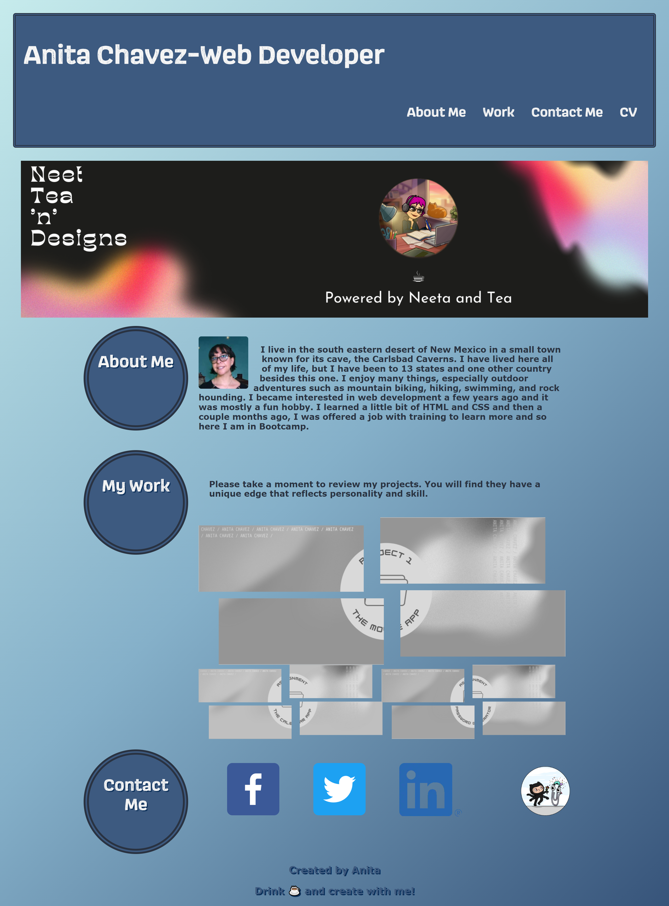

# Portfolio25
This project is to demonstrate who I am and the projects I have worked on. 
## Description
My portfolio has three projects so far. I have updated my portfolio so that is it more poslished and has better complimenting colors. I hav chosen my favorite projects and added them to my portfolio's work section. I look forward to continue learning and adding to my portfolio.
## Installation
This project should work on most browsers
Check out the deployed link here :point_right: [Deployed Link](https://neeta525.github.io/Portfolio25/)

## Screenshot
Here is a screenshot of my Portfolio

#Credits

## Author
- Anita Chavez
- :briefcase: [Portfolio](https://neeta525.github.io/Portfolio25/)
- :octocat: [GitHub](https://github.com/Neeta525)

## Built With:
- HTML
- CSS
- JavaScript

## License

- MIT
